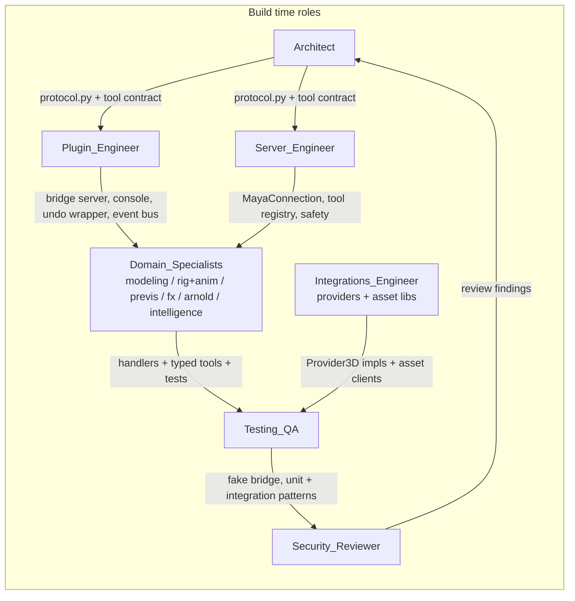
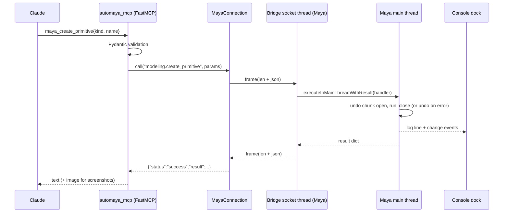
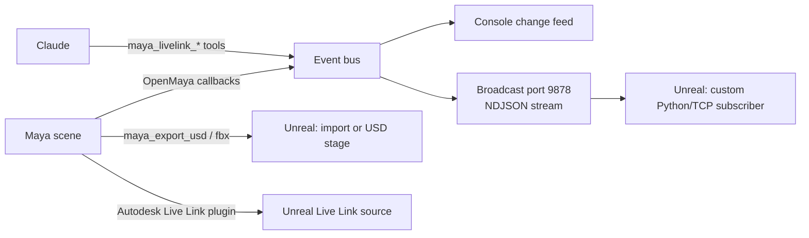

# AutoMaya MCP: Architecture and Orchestration

## Phase 1: constraints (contextual intake)

| # | Constraint | Source |
|---|-----------|--------|
| C1 | Target is Autodesk Maya 2024 (Python 3.10.8, PySide2 5.15, Qt 5.15, OpenMaya 2.0). Nothing outside the stdlib may be imported inside Maya. | Maya 2024 ships its own interpreter |
| C2 | All `maya.cmds` / OpenMaya calls must run on Maya's main thread. Socket I/O must never block the UI for longer than a single command. | Maya threading rules |
| C3 | Server side is Python 3.10+ using the official `mcp` SDK (FastMCP), stdio transport for Claude Desktop / Claude Code / Cursor. | User choice |
| C4 | Must include an in-DCC console (dockable panel) like the Blender MCP sidebar, plus a REPL and a live change feed. | User request |
| C5 | Provider hooks: Tripo 3D, Meshy, Hyper3D Rodin, Tencent Hunyuan3D (official + local), Higgsfield. Shared provider interface so more can be added. | User request |
| C6 | Feature packs: asset libraries, previs, rigging + animation, scene intelligence, simulation, modeling, textures, VFX, Arnold. | User request |
| C7 | The server must "understand Maya" deeply enough to drive a real time Unreal viewport: change tracking through OpenMaya callbacks, scene graph snapshots, mesh and transform streaming, USD/FBX export, and Live Link hand off. | User request (Weta style real time viewport) |
| C8 | Beat every existing Maya MCP on: framed protocol, main thread safety, undo safety, in-DCC UI, screenshots as MCP images, asset libraries, AI generation, human edit awareness, installer. | Competitive teardown |
| C9 | Secrets never leave the user's machine except to the provider they belong to. Keys are read from env, then the plugin's saved prefs. | Security |
| C10 | Every mutating tool is wrapped in an undo chunk and rolled back on failure. Arbitrary code execution is on by default but passes a validator, and can be locked with `AUTOMAYA_SAFE_MODE=1`. | Security |

## Phase 2: context synthesis

The gaps found in the eight existing Maya MCPs: six of them ride Maya's `commandPort`, which blocks the UI, has no framing, and forces a security prompt each session. Only one has a console, none have asset libraries or AI generation, none track what the human changed between calls, none return screenshots as images. Blender MCP (26.8k stars) wins on: a queue drained on the main thread, a `{"type","params"}` JSON protocol, a sidebar with integration toggles, and a curated `asset_creation_strategy` prompt.

AutoMaya adopts the Blender MCP shape, then goes past it: length prefixed frames (no "parse until it works" hack), typed domain handlers living inside Maya (so tools are real operations rather than code strings), an event bus built on `MDGMessage` / `MNodeMessage` / `MEventMessage` callbacks that feeds both the console and a broadcast port for Unreal, and a provider abstraction that treats every 3D generator as `submit -> poll -> download -> import`.

## Phase 3: agent orchestration

Roles used to build and to run the system.



Runtime handoff (what happens on one tool call):



Unreal real time viewport path:



## Wire protocol (shared by plugin and server: `protocol.py`)

Frame: 4 byte big endian unsigned length, then UTF-8 JSON.

Request: `{"id": "<uuid>", "type": "<domain.command>", "params": {...}}`
Response: `{"id": "<uuid>", "status": "success" | "error", "result": ..., "message": "...", "traceback": "...", "elapsed_ms": n}`

Special commands: `core.ping`, `core.handshake` (returns plugin version, Maya version, protocol version, enabled integrations), `core.execute_python`.

## Package layout

```
maya_plugin/automaya_bridge/      loaded inside Maya (stdlib only)
  __init__.py     start()/stop()/show_console() entry points
  protocol.py     framing + message helpers (copied verbatim into server package)
  server.py       socket server, main thread dispatch, registry
  registry.py     @command decorator, undo wrapper, error envelope
  events.py       OpenMaya callback bus + broadcast port
  console.py      PySide2 dockable console
  prefs.py        optionVar backed settings + API keys
  handlers/       one module per domain
scripts/userSetup.py, automaya.mod   auto start on Maya launch
src/automaya_mcp/                    the MCP server
  server.py       FastMCP app, lifespan, prompts
  connection.py   MayaConnection (framed client, lock, reconnect, discovery)
  protocol.py     same as plugin copy
  safety.py       code validator
  providers/      Provider3D ABC + tripo, meshy, rodin, hunyuan, higgsfield, polyhaven, sketchfab, polypizza
  tools/          one module per domain, each exposes register(mcp, bridge)
tests/            fake bridge + provider mocks
```

## Tool catalogue (prefix `maya_`)

core: get_status, execute_python, execute_mel, ping, drain_changes, get_console_log
scene: new, open, save, import, export (fbx/obj/abc/usd), get_scene_info, list_nodes, get_node_info, select, delete, rename, parent, group, set_attr, get_attr, connect_attr, undo, redo, get_selection
modeling: create_primitive, create_curve, extrude, bevel, boolean, combine, separate, mirror, smooth, poly_reduce, transform, duplicate, instance, freeze_transforms, center_pivot, delete_history, mesh_stats, uv_auto, lattice
materials: create_material (lambert/blinn/standardSurface/aiStandardSurface), assign_material, set_texture (file node wiring for any map), create_shading_network_from_maps, list_materials, set_material_attr
rigging_animation: create_joint_chain, orient_joints, bind_skin, create_ik, create_control, set_keyframe, get_keyframes, set_time_range, set_current_time, playback, bake_animation, motion_path, retarget_hint, import_animation
previs: create_camera, set_camera_lens, frame_selected, create_shot_camera_rig, list_cameras, look_through, playblast, set_resolution, create_sequence_shot, camera_sequencer_info, add_image_plane
sim_vfx: create_ncloth, create_nparticle, create_fluid, create_rigid_body (Bullet), create_nhair, bake_simulation, cache_alembic, create_bifrost_graph_hint, create_instancer
arnold: load_mtoa, create_light (area/skydome/mesh/photometric), set_render_settings, render_frame (returns image), create_aov, set_ai_attributes, render_sequence
assets: polyhaven_search/categories/download (hdri -> aiSkyDome or skydome; textures -> network; models -> import), sketchfab_search/preview/download, polypizza_search/download
generation: gen3d_list_providers, gen3d_text_to_3d, gen3d_image_to_3d, gen3d_poll, gen3d_import, gen3d_rig (tripo/meshy), gen3d_retexture (meshy), gen3d_remesh (meshy)
intelligence: viewport_screenshot (MCP image), scene_summary (hierarchical, budgeted), scene_diff, find_problems (non manifold, unfrozen, missing textures, scale issues), inspect_selection, get_history_stack
livelink: start_stream, stop_stream, stream_status, subscribe_nodes, snapshot_scene_graph, get_mesh_buffers, export_usd_live, livelink_hint
introspect: list_commands, command_help, node_type_schema, list_node_types, plugin_info, list_plugins, env_info, ui_tree, list_menus, search_docs (offline index built from cmds.help)

## Phase 4 gates

Every domain module ships with a unit test (server side, against the fake bridge) and an integration test pattern (runnable inside `mayapy` via `tests/maya_integration/`). The security review checks: code validator coverage, secret handling, socket bind to localhost only, size limits, undo safety.
